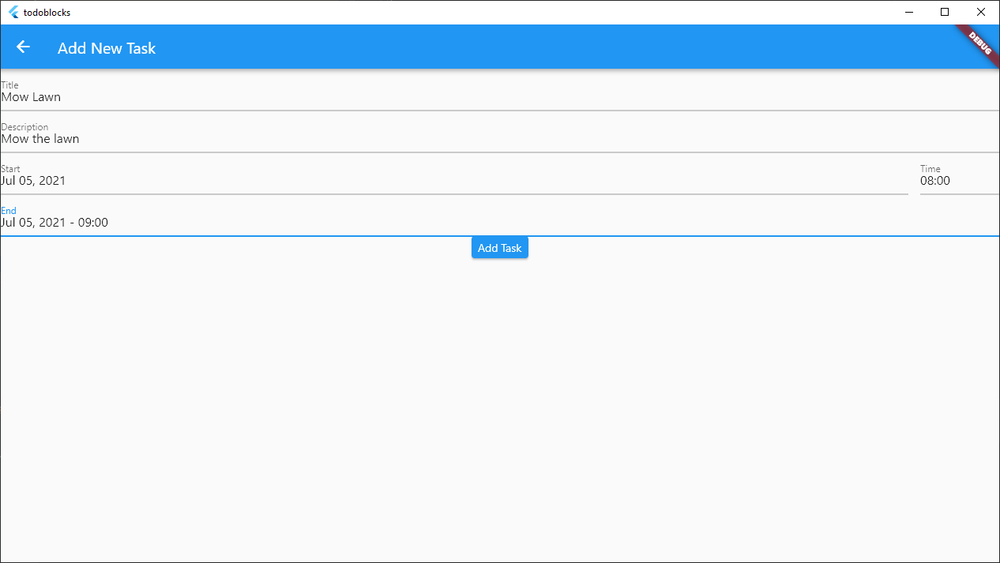
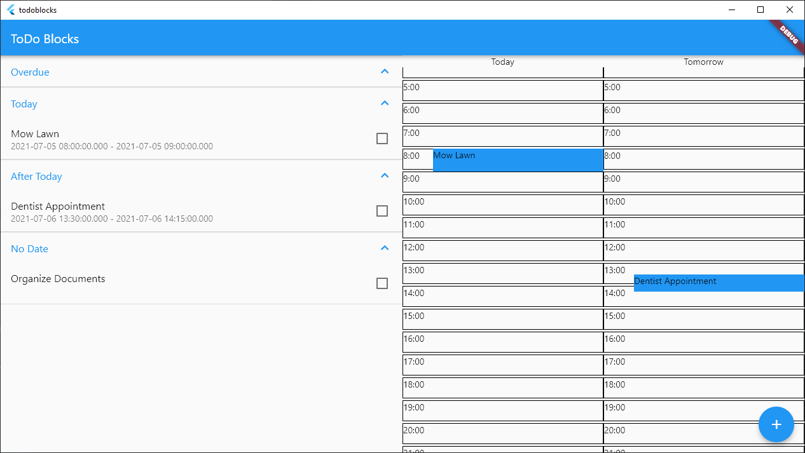

# To-Do Blocks

## Time Blocking Software

### Instructions
Press the add task button in the bottom right to go to the add task menu. From there, enter your task details. (Only title is required.) When you go back to the main screen, you may have to expand the task category to see your added task. If you provided both a start and end time that takes place today or tomorrow, your task will show up on the schedule at its respective time slot. To complete a task, click on the check box in the task list. Your data is stored in between sessions.

### Platform Compatibility
Originally designed for desktop. Works fine on mobile, although things are a little squished.

### Known issues:
- Tasks can't overlap each other
- Tasks can't overlap day boundaries
- Cannot delete or modify tasks (other than marking them complete)
- Generally not useful, more of a proof-of-concept